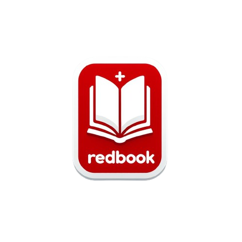
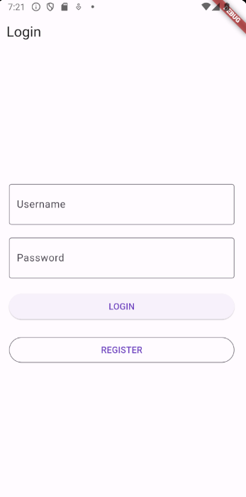
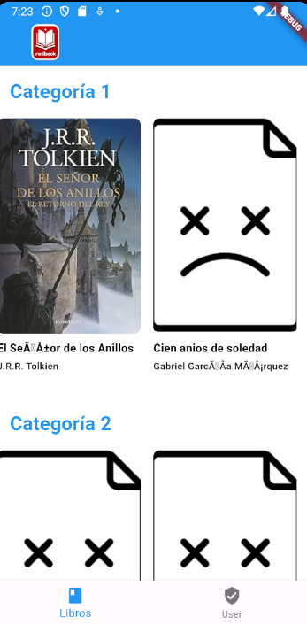
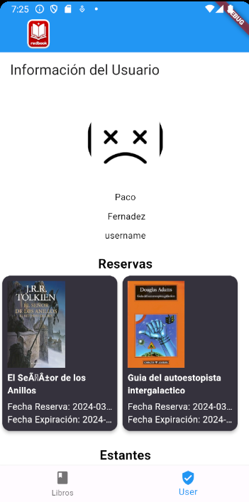
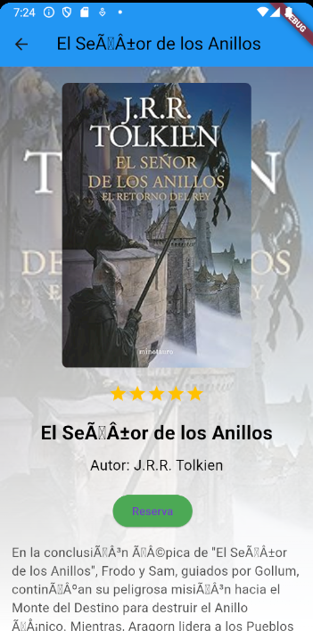
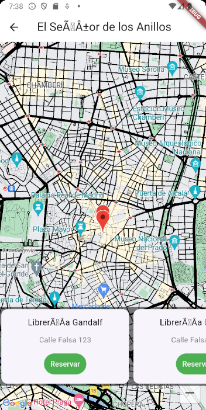
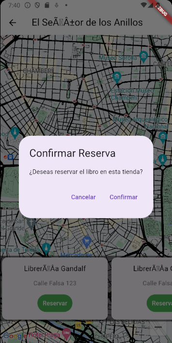
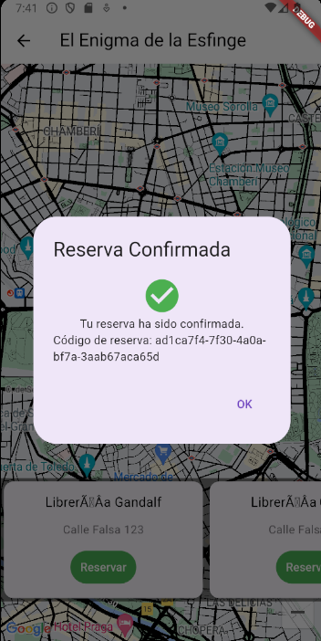

# REDBOOK

## Descripción

**REDBOOK** es una innovadora aplicación móvil diseñada para los apasionados de la lectura. Ofrece una solución integral para gestionar tu biblioteca personal de libros y conectar con tiendas locales para reservar y descubrir nuevas lecturas. Con REDBOOK, llevar un registro detallado de tu colección nunca ha sido tan fácil, permitiéndote además acceder a una amplia red de tiendas de libros en tu área.

## Funcionalidades Principales

- **Gestión de Biblioteca Personal**: Añade, organiza y lleva un seguimiento de los libros que tienes, los que deseas adquirir y los que ya has leído.
  
- **Reservas en Tiendas Locales**: Encuentra y reserva libros en tiendas locales directamente desde la aplicación, facilitando el apoyo al comercio de tu comunidad.
  
- **Recomendaciones Personalizadas**: Recibe sugerencias de libros basadas en tus gustos y preferencias de lectura.
  
## Páginas de la Aplicación

1. **Login**: Página para iniciar sesión en la aplicación.

   

2. **Home**: Página principal que muestra una visión general y acceso a las diferentes secciones.

   

3. **Libros**: Página que lista los libros disponibles.

   

4. **User**: Página de perfil del usuario donde puede gestionar su información.

   

5. **Detalle del Libro**: Página que muestra información detallada sobre un libro específico, incluyendo la descripción, valoraciones, y opciones para reservar.

   

6. **Reserva**: Página que permite al usuario reservar un libro, mostrando un mapa con las localizaciones de las tiendas que tienen el libro en stock.

   
   
   

